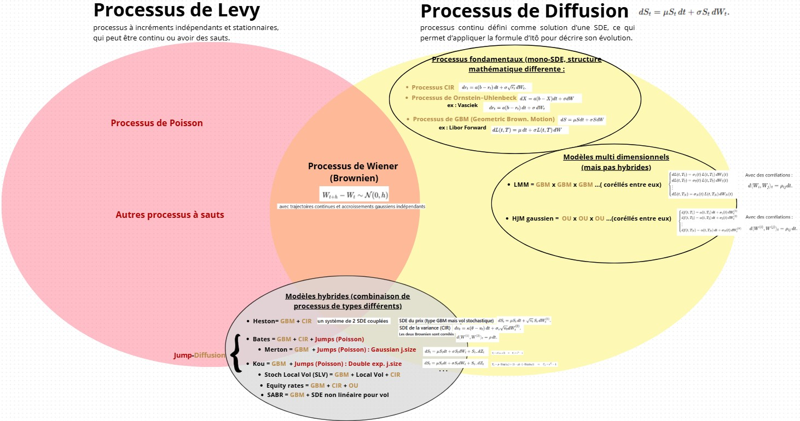

# 03 – Brownian Motion, Itô Calculus and SDEs

**Hi there! 👋**

## About

*Continuous-time models are where randomness becomes smooth, unpredictable yet structured.
This section is about learning that structure, how noise accumulates, how randomness can be "integrated", and how an entire world of diffusions emerges from a single object: Brownian motion.*

We start from the microscopic behaviour of random paths, take the leap into Itô calculus, and finally reach full stochastic differential equations (SDEs).
Everything that follows — Black–Scholes, Heston, interest-rate models, American options, stochastic volatility — rests on this block.

To set the stage, here is the landscape of continuous-time processes we will encounter:

## Content

This section develops the theory and the numerical practice of Brownian motion and SDEs, from the core properties of $W_t$ to the simulation of diffusion models used in quantitative finance.

The notebooks combine clean probabilistic foundations (Gaussian increments, filtrations, martingales), rigorous Itô calculus, and full-scale numerical experiments (Euler–Maruyama, OU, GBM, Monte Carlo pricing).

The objective is simple: turn abstract continuous-time models into something we can simulate, visualise, and use for real financial applications.

## Structure

| Notebook | Title | Core Idea |
|----------|-------|-----------|
| 03.1 | Continuous-Time Processes | Filtrations, adapted processes, stopping times. First visual intuition of continuous-time randomness. |
| 03.2 | Brownian Motion | Construction, Gaussian increments, scaling, quadratic variation. Rigorous tests and simulations. |
| 03.3 | Continuous-Time Martingales | Martingale properties of $W_t$, $W_t^2 - t$, exponentials. Optional stopping in continuous time. |
| 03.4 | Itô Integral & Itô Calculus | From simple integrands to the Itô integral. Itô isometry. Itô's formula in 1D and multi-dimensions. |
| 03.5 | SDEs & Numerical Schemes | Euler–Maruyama, strong convergence, OU and GBM case studies, Monte Carlo pricing under GBM. |

## Notes to viewers

Feel free to adapt or extend these notebooks depending on your background.

If this is your first time working with Brownian paths, take it slow: nothing in continuous time is intuitive at first. Trajectories are nowhere differentiable, variation is infinite, integrals must be rebuilt from scratch — but watching real simulations will make the theory click much faster than the formulas alone.

If you already know the theory, challenge the notebooks: experiment with different time steps, try Milstein, simulate Lévy jumps, test convergence failures when assumptions are broken, or calibrate OU/GBM parameters on synthetic data.

Make sure the standard modules are available in your environment (NumPy, Pandas, Matplotlib, SciPy if needed).

---

***Alexandre Mathias DONNAT, Sr***
