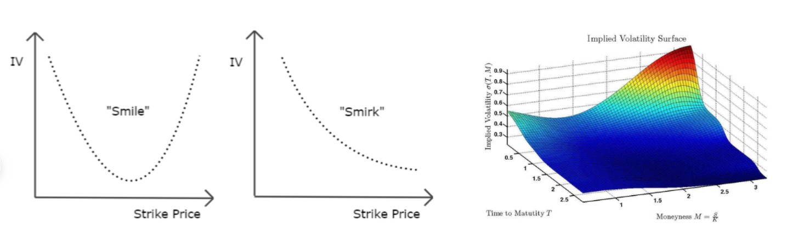

# 04 - The Black–Scholes Model

**Hi there ! 👋**

## About

*Inside the Black–Scholes engine we uncover the machinery of modern option pricing: the model that turns raw market option prices into implied volatility smiles and surfaces, and from these implied surfaces into local volatility dynamics used in desk-level SDE simulations. Here we open the hood and examine the mathematical conditions that make this entire machinery run.*

This is therefore the point where the probabilistic framework built in earlier sections crystallises into one of the most elegant achievements of quantitative finance: a complete, arbitrage-free diffusion model where every payoff can be priced through martingale methods, solved through PDEs, and hedged dynamically

## Content

This section develops the continuous-time Black–Scholes model from first principles:

- Geometric Brownian motion,
- Risk-neutral valuation,
- Girsanov theorem & Martingale representation,
- Replication and completeness,
- Black–Scholes PDE,
- Closed-form pricing formulas and Greeks,
- American option early exercise logic,
- Implied volatility smile & surface,
- Local volatility & Dupire's formula.

Each notebook mixes rigorous mathematics with numerical experiments, Monte Carlo simulation, hedging backtests, and visualisation tools (smiles, surfaces).

## Structure

| Notebook | Title | Core Idea |
|----------|-------|-----------|
| 04.1 | The Black–Scholes Model | Define GBM, solve the SDE, express discounted assets as martingales. Foundation of the whole chapter. |
| 04.2 | Martingale Representation & Completeness | Any payoff = stochastic integral → dynamic hedging. Why Black–Scholes is a complete market. |
| 04.3 | European Options – PDE, Pricing, Greeks | Derive the BS PDE, solve it, obtain closed-form call/put formulas, compute Greeks, validate with Monte Carlo. |
| 04.4 | American Options – Optimal Stopping | Optimal stopping in diffusion setting, Snell envelope, numerical backward induction, early exercise boundary. |
| 04.5 | Implied & Local Volatility | Build volatility smiles & surfaces, invert BS numerically, introduce local volatility via Dupire, discuss VIX. |

## Notes to viewers

Feel free to explore these notebooks at your own pace, depending on how familiar you already are with the Black–Scholes framework.

If you are just starting out, take your time with the underlying mathematical ideas: understanding main theorems and the structural concepts they rely on is essential. These results are the backbone of everything that follows, and building intuition step by step will help the theory click much faster.

If this is your first deeper look at diffusion-based option pricing, don’t rush: connecting stochastic calculus, PDEs, implied volatility and hedging takes time, and the intuition grows gradually. Running simulations, plotting smiles, and seeing how hedges behave will make the theory much more concrete than the equations alone.

If you already know the core results, use these notebooks to push further: stress-test the assumptions, compare implied vs local vol behaviour, simulate delta hedging with different rebalancing schemes, or experiment with how model misspecification flows into P&L. The code cells are written to be modifiable, so feel free to try your own paths, parameters, or volatility structures.

Before running the notebooks, make sure the standard modules are installed (NumPy, Pandas, Matplotlib, SciPy, warnings). If you want to pull raw market data for smiles or term structures, yfinance is also included and used in the implied-volatility notebook. You can disable warnings at the top of each notebook if you prefer a cleaner output.

---

***Alexandre Mathias DONNAT, Sr***
